# Wiring &amp; mechanical hardware

The enclosure, GPIO wiring, and fasteners for the Pi Zero appliance. This
describes the physical unit; see [docs/ARCHITECTURE.md](../docs/ARCHITECTURE.md)
for the software.

**Confidence:** the GPIO pinout below is derived from a verbal description of
wire positions (not yet checked against a photo, though the actual wiring is
reportedly messy and due for a check), but it lines up exactly with the two
GPIO numbers hardcoded in `main.py` (`button_pin=17`, `leds_pin=27`) — see the
note under [GPIO pinout](#gpio-pinout). See [Open questions](#open-questions)
for what's still unconfirmed, including whether the tray LEDs' physical
wiring actually has the current-limiting resistor(s) the design calls for.

## Parts list

### Mechanical (enclosure)

MDF panels, cut from the DXFs in [`dxfs/`](dxfs): `back`, `background`,
`backstop`, `bed`, `bottom`, `bottom_front`, `camera_mount`, `left_side`,
`right_side`, `top`, `top_front`. Panel stock is nominal 1/4 in (6 mm) MDF.

All lengths below are the nearest **standard, commonly-stocked** metric
fastener size to what was measured — measurements were taken with imperial
calipers, so treat the source numbers as approximate and the metric sizes as
the shopping list, not the other way around.

| Part | Spec | Qty | Notes |
| --- | --- | --- | --- |
| Panel-to-panel screw | **M3 x 16 mm button head cap screw**, hex/Allen drive | TBD | Measured 0.115 in across the threads (2.9 mm, ~M3's 3 mm nominal major diameter) and 0.61 in long (15.5 mm -> nearest standard length **16 mm**). "Rounded head" = button head, not socket (cylindrical) head. Joins the MDF panels. |
| Pi standoff | **M2.5 nylon standoff, female-female** | 4 | Mounts the Pi to the back panel. **Currently installed: 12 mm** (measured ~0.5 in / 12.7 mm -> nearest standard **12 mm**) — too tall, crowds the HAT. **Target/replacement: 5 mm** (measured ~0.2 in / 5.08 mm -> nearest standard **5 mm**), not yet swapped in. Standoff length is the gap from the back panel to the underside of the Pi board. |
| Pi standoff screw | **M2.5 nylon screw**, 2 lengths | 8 | **10 mm** through the 6 mm MDF back panel into the 5 mm standoff (~4 mm thread engagement); **6 mm** through the ~1.6 mm Pi PCB into the standoff's other end (~4.4 mm engagement). Calculated from the 5 mm target standoff length, not test-fit yet — confirm once the shorter standoffs are in hand. |
| Camera mount screw | **M2 button head cap screw, 14 mm** | 2 | Measured 0.52 in (13.2 mm) -> nearest standard **14 mm**. Passes through the 6 mm MDF `camera_mount` panel. Diameter assumed M2 (the official Pi Camera Module mounting-hole spec); not independently measured. |

### Electronic

| Part | Spec |
| --- | --- |
| SBC | Raspberry Pi Zero (2 W or W — camera + I2C + GPIO) |
| Camera | Pi Camera Module, `ov5647` sensor, CSI ribbon |
| Display | Adafruit HT16K33 backpack, 4-digit 14-segment, I2C. **VCC pad bridged to Vi2c** on the backpack (both powered from the same 3.3 V rail — see [GPIO pinout](#gpio-pinout)) |
| Button | Momentary pushbutton, not illuminated. Wired to 3.3V (blue) and `GPIO17` — no separate ground leg. Confirmed (see the polarity note under [GPIO pinout](#gpio-pinout)) |
| Tray LEDs | 2 fixed LEDs. **By design**, powered through the transistor from the 5V rail with appropriate current-limiting resistor(s) — this is the intended circuit, not just what's physically present. Physical confirmation that a resistor is actually in the heat-shrunk splice is still open — see [Open questions](#open-questions). |
| LED driver | **2N2222 NPN transistor**, 1 kΩ resistor on the base (middle pin of the TO-92 package). `GPIO27` (yellow wire) drives the base through the 1 kΩ resistor; standard low-side switch — emitter to ground, collector to the LED string, LED string returns to the 5V rail through its own current-limiting resistor(s) by design |

## GPIO pinout

The Pi's 40-pin header is 20 rows of 2 pins, running away from the SD card
slot. "Row *N*" below counts rows from the SD-card end (row 1 = pins 1/2).
Within a row, **inside** = the odd-numbered pin, **outside** = the
even-numbered pin (this convention is inferred from the SDA/SCL/button/LED
positions lining up correctly against known values — see the note below).

| Row (from SD card) | Inside pin | Outside pin | Wire | Function |
| --- | --- | --- | --- | --- |
| 1 | Pin 1 — **3.3V** | Pin 2 — **5V** | Blue (inside) / Red (outside) | Blue: display VCC/Vi2c + button. Red: 5V rail (LED driver supply) |
| 2 | Pin 3 — **GPIO2 (SDA1)** | Pin 4 — 5V | — | Display SDA |
| 3 | Pin 5 — **GPIO3 (SCL1)** | Pin 6 — **GND** | Black (outside) | Display SCL. Black: ground return |
| 6 | Pin 11 — **GPIO17** | Pin 12 — GPIO18 | — | Button signal (active-high, internal pull-down — see note below) |
| 7 | Pin 13 — **GPIO27** | Pin 14 — GND | Yellow (inside) | LED driver control, via transistor |

**Why I trust this mapping:** `main.py`'s defaults are `--button-pin 17` and
`--leds-pin 27` (`resistor_reader/main.py:305-306`). Under the inside/outside
convention above, "button returns through inside 6 down" lands on pin 11 =
BCM GPIO17, and "yellow, just below the button wire" lands on pin 13 = BCM
GPIO27 — both match the code exactly, with no fitting involved. The same
convention independently puts SDA at row 2 inside (pin 3 = BCM GPIO2, the I2C1
SDA pin) and SCL at row 3 inside (pin 5 = BCM GPIO3, I2C1 SCL) — again exactly
where the code expects them (`board.I2C()` in `setup_display()` uses the
default I2C1 bus). Four independent checks landing correctly is strong
evidence the row/inside/outside convention is right.

**Button polarity — confirmed, and fixed in code.** The button's two legs are
3.3V (blue) and GPIO17 — no ground leg. `setup_gpio()` in `main.py` used to
configure `Button(pin, pull_up=True, ...)`, which enables the *internal*
pull-up on GPIO17 and only registers a press when the pin reads **LOW** — i.e.
it expected the switch to short the pin to **ground**. Wired to 3.3V instead,
pressing the button tied an already-pulled-up pin to 3.3V again: no edge for
`wait_for_press()`/`wait_for_release()` to see, so presses would not have
registered. Changed to `pull_up=False`: gpiozero now enables the internal
pull-down instead, so the pin idles LOW and reads HIGH on a press — matching
a switch wired to 3.3V exactly, with no rewiring needed. **Not yet tested on
the physical unit** — worth pressing the button and confirming `read`/`camera`
mode actually triggers.

**Why 3.3V for the display, not 5V:** the HT16K33 backpack's VCC pad is
bridged to its Vi2c pad, so whatever powers VCC also sets the I2C logic-level
threshold. Powering it from pin 1 (3.3V) instead of pin 2/4 (5V) matches the
Pi's native 3.3V GPIO logic levels — no level shifter needed on SDA/SCL.

**Why 5V for the LEDs, not 3.3V:** two reasons. First, headroom — if the 2
LEDs are in series, their combined forward voltage (~3.6-4.4V typical) leaves
little to nothing on a 3.3V rail once the transistor's saturation drop and
wire resistance are subtracted; even in parallel, 3.3V leaves the
current-limiting resistor small and the circuit sensitive to normal LED Vf
tolerance. Second, rail loading — 3.3V is the Pi's regulated logic rail,
already feeding the display over I2C on a fairly tight current budget; the 5V
rail is close to a straight pass-through of the USB power input and has much
more headroom, which is why it's the conventional choice for driving external
LED/relay loads off a Pi. (The I2C link to the display has been intermittent
on this unit before — a loose connector is the leading suspect, not rail
loading, but it's one more reason not to add switched load to 3.3V.) **This
is the intended design**, confirmed: LEDs powered through the transistor from
5V, with appropriate current-limiting resistor(s) in the LED leg — not
switched logic-level current straight off a GPIO.

## Circuit

```mermaid
graph LR
    subgraph Pi["Pi Zero 40-pin header"]
        P1["Pin 1 — 3.3V"]
        P2["Pin 2 — 5V"]
        P3["Pin 3 — GPIO2 SDA1"]
        P5["Pin 5 — GPIO3 SCL1"]
        P6["Pin 6 — GND"]
        P11["Pin 11 — GPIO17"]
        P13["Pin 13 — GPIO27"]
    end

    P1 -->|blue| DVCC["Display VCC + Vi2c"]
    P3 -->|SDA wire| DSDA["Display SDA"]
    P5 -->|SCL wire| DSCL["Display SCL"]
    P6 -->|black| GND["Ground bus"]

    P1 -->|blue| BTN["Button (not illuminated)"]
    P11 ---|GPIO17, internal pull-down| BTN

    P2 -->|red| RAIL5V["5V rail"]
    P13 -->|yellow| BASE["1k&#8486; base resistor"]
    RAIL5V --> Q1["2N2222 (collector)"]
    BASE --> Q1
    GND -->|emitter| Q1
    Q1 --> LEDS["2x tray LEDs"]

    style DVCC fill:#3b82f6,color:#fff
    style RAIL5V fill:#ef4444,color:#fff
    style GND fill:#111,color:#fff
    style BASE fill:#eab308,color:#000
```

## Open questions

Answering these turns this from a reconstruction into a verified reference:

1. **LED current-limiting resistor — confirm the build matches the design
   before running the LEDs much more.** By design the LED leg has its own
   current-limiting resistor(s) off the 5V rail; whether that resistor is
   actually present in the physical splice is still unconfirmed — it's
   heat-shrunk, which is consistent with one being hidden inside (heat
   shrink over an in-line splice is a common way to insulate an exposed
   resistor lead) but isn't proof. If it's missing in practice: driven
   straight off 5V through a saturated 2N2222 with no resistor, the only
   things limiting current are the transistor's ~0.2V `Vce(sat)` and wire
   resistance — a few ohms at most — so current would run far past a
   typical LED's ~20 mA rating, usually enough to kill it quickly (or
   immediately) and to run the transistor hot. Two LEDs in series softens
   this (their combined ~3.6-4.4V forward drop eats most of the 5V), but
   it's still uncontrolled and prone to thermal runaway — not a substitute
   for the resistor the design calls for. To check without fully
   desoldering: power off, nick and peel back a small window of the heat
   shrink to look for a resistor body inline in the wire (color bands), then
   re-cover it; or, powered on, measure the DC voltage across the
   heat-shrunk splice itself — a resistor in there will show a few tenths of
   a volt to a few volts of drop, a plain wire splice will read near 0V. If
   it's genuinely missing, add one (a few hundred ohms is a reasonable
   starting point for 5V and a common LED `Vf` around 2V, but recompute for
   the actual LED and the series/parallel arrangement below).
2. **LED series/parallel arrangement** — needed to size a resistor correctly
   if one has to be added.
3. **Standoff screw lengths (10 mm / 6 mm) are calculated, not test-fit** —
   confirm they seat properly once the 5 mm standoffs are actually swapped in.
4. **A photo of the actual header wiring**, to confirm the inside/outside and
   row-counting convention directly rather than by inference from `main.py`'s
   pin defaults — flagged as messy and due for a check.
5. **Button fix needs a physical test** — the `pull_up=False` change in
   `main.py` matches the documented wiring but hasn't been tried on the unit.
