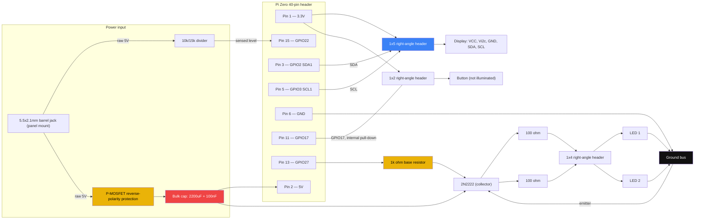

# Wiring & mechanical hardware

The enclosure, GPIO wiring, and fasteners for the Pi Zero appliance. This
describes the physical unit; see [docs/ARCHITECTURE.md](../docs/ARCHITECTURE.md)
for the software.

## Parts list

### Mechanical (enclosure)

MDF panels, cut from the DXFs in [`dxfs/`](dxfs): `back`, `background`,
`backstop`, `bed`, `bottom`, `bottom_front`, `camera_mount`, `left_side`,
`right_side`, `top`, `top_front`. Panel stock is nominal 1/4 in (6 mm) MDF.

| Part | Spec | Qty |
| --- | --- | --- | 
| Panel-to-panel screw | M3 x 16 mm button head cap screw | 20 | 
| Panel-to-panel nuts | M3 nuts | 20 | 
| Pi standoff | M2.5 x 12 mm nylon standoff, female-female | 4 | 
| Pi standoff screw | M2.5 x 8 mm nylon screw | 8 | 
| Camera mount screw | M2 x 14 mm button head cap screw | 4 | 
| Camera mount nuts | M2 nuts | 4 | 

### Electronic

| Part | Spec |
| --- | --- |
| SBC | Raspberry Pi Zero |
| Camera | Pi Camera Module, `ov5647` sensor, CSI ribbon |
| Display | [Adafruit HT16K33 backpack, 4-digit 14-segment](https://www.adafruit.com/product/1911) |
| Button | Momentary pushbutton — see [Button wiring](#button-wiring) |
| Tray LEDs | 2x white LEDs — see [LED driver](#led-driver) |
| LED resistors | 2x 100Ω, 1/4W, one per LED branch |
| LED driver transistor | 2N2222 NPN, low-side switch: emitter to ground, collector to the LED branches' common return |
| LED base resistor | 1kΩ |
| Reverse-polarity protection | P-channel MOSFET, high-side reverse-polarity stage on the incoming 5V |
| Bulk capacitance | ~2200µF low-ESR electrolytic + 100nF ceramic, on the 5V rail near the Pi's power pin |
| DC-input-sense divider | 10kΩ / 15kΩ resistor divider, tapped off the raw incoming 5V (before reverse-polarity protection) into a spare GPIO |
| Power input jack | 5.5x2.1mm panel-mount DC barrel jack, center-positive — mounts in a hole in the case's back panel |
| Board power connector | 1x2 right-angle male header (board side) + matching Dupont female housing (harness side) — see [Connectors](#connectors)|
| LED connector | 1x4 right-angle male header (board side) + matching Dupont female housing (harness side) — see [Connectors](#connectors) |
| Display connector | 1x5 right-angle male header (board side) + matching Dupont female housing (harness side) — see [Connectors](#connectors) |
| Button connector | 1x2 right-angle male header (board side) + matching Dupont female housing (harness side) — see [Connectors](#connectors) |

## Power input

Power comes in over a panel-mount DC barrel jack, 5V only — no USB-C, no
negotiation of any kind, no buck/boost stage, since the input is already at
the 5V the Pi and LEDs want. This is deliberately the simplest option: a
barrel jack is just two conductors (center + shield), with no connector-side
electronics or breakout board to select and mate.

- **Connector:** a 5.5x2.1mm panel-mount DC barrel jack, center-positive
  (the near-universal convention for 5V wall adapters), mounted in a hole in
  the case's back panel. Two wires run from it to a 2-pin header on the
  board.
- **Current headroom:** unlike USB-C, there's no negotiation step at all —
  whatever the wall adapter is rated for is what's available, no resistor
  values or connector logic involved. **Minimum recommended supply: 5V/2A**,
  given the worst-case simultaneous load of camera capture + both LEDs +
  display digits lit at once.
- **Reverse-polarity protection:** a P-channel MOSFET stage rather than a
  series diode — a diode's ~0.3-0.4V drop would eat too far into the Pi's
  already-thin under-voltage margin on a bare 5V-in design with no
  regulator stage to make it up. This matters more than it would with
  USB-C: a barrel jack has no keying or polarity enforcement at all, and
  center-negative 5V adapters do exist, so a miswired or wrong adapter is a
  real (not just theoretical) risk here.
- **Bulk capacitance** on the 5V rail near the Pi's power pin does two
  jobs, which is why it's sized above a "just for ripple" value:
  1. Smooths the short (sub-second) current spike from camera + LEDs +
     display all drawing at once — the moment a reading is actually taken.
  2. Bridges the Pi through a clean shutdown once power loss is detected
     (see [Soft shutdown](#soft-shutdown-on-power-loss) below) for a few
     hundred ms under typical debugging-session load. This is explicitly
     **not** sized to survive a worst-case fully-loaded unplug — a
     guarantee like that would need a supercap + boost UPS stage, which
     was considered and deliberately skipped in favor of this simpler cap.
  Final value should be checked against measured peak current once built,
  not just typical datasheet numbers.
- The protected, buffered 5V feeds the Pi's 5V pin directly (powered via
  the GPIO header rather than the Pi's own micro-USB port) and the LED
  driver branch.
- If `vcgencmd get_throttled` or dmesg under-voltage warnings show up
  during real-load testing anyway, the next step is a shorter/thicker
  cable/wire run or an added boost stage — not built in preemptively.

### Soft shutdown on power loss

To reduce the risk of SD card corruption if the barrel jack is unplugged —
most relevant when the root filesystem's read-only protection is turned off
for debugging — a spare GPIO senses the raw incoming 5V (before the
reverse-polarity stage) through the 10kΩ/15kΩ divider above. That raw input
collapses essentially instantly on unplug, well before the downstream bulk
capacitor sags, so the Pi gets an early edge to react to while it's still
running on stored charge. A small watcher (same gpiozero pattern already
used for the button in `resistor_reader/main.py`) should trigger a clean
`shutdown -h now` on that falling edge. **This watcher script/systemd unit
is a software follow-up, not delivered as part of this hardware plan** —
see the checklist below.

## GPIO pinout

The Pi's 40-pin header is 20 rows of 2 pins, running away from the SD card
slot. "Row *N*" below counts rows from the SD-card end (row 1 = pins 1/2).
Within a row, **inside** = the odd-numbered pin, **outside** = the
even-numbered pin.

| Row (from SD card) | Inside pin | Outside pin | Function |
| --- | --- | --- | --- |
| 1 | Pin 1 — **3.3V** | Pin 2 — **5V** | Inside: display VCC/Vi2c + button. Outside: 5V rail (LED driver supply + Pi power) |
| 2 | Pin 3 — **GPIO2 (SDA1)** | Pin 4 — 5V | Inside: display SDA |
| 3 | Pin 5 — **GPIO3 (SCL1)** | Pin 6 — **GND** | Inside: display SCL. Outside: ground return |
| 6 | Pin 11 — **GPIO17** | Pin 12 — GPIO18 (unused) | Button signal, active-high, internal pull-down — see [Button wiring](#button-wiring) |
| 7 | Pin 13 — **GPIO27** | Pin 14 — GND | LED driver control, via transistor base resistor |
| 8 | Pin 15 — **GPIO22** | Pin 16 — GND (unused) | DC-input-sense input for soft shutdown — new, not yet read by any software |

Matches `main.py`'s existing defaults (`button_pin=17`, `leds_pin=27`,
`resistor_reader/main.py:305-306`) and I2C1 defaults (`board.I2C()` in
`setup_display()`). GPIO22 is newly assigned for VBUS sensing and isn't
referenced by any code yet.

## Button wiring

The button sits between 3.3V and `GPIO17`, with no separate ground leg.
`setup_gpio()` in `main.py` configures `Button(pin, pull_up=False, ...)`,
which enables GPIO17's internal pull-down: the pin idles LOW and reads HIGH
when the button ties it to 3.3V on a press. This is the deliberate design —
it needs no external pull resistor and no code changes.

## LED driver

The two tray LEDs are white, which puts their forward voltage
around 3.0-3.2V @ 20mA typical — too high for two in series on a 5V rail
(that would need ~6.0-6.4V combined). They're wired as **two parallel
branches**, each with its own 100Ω resistor, sharing a single 2N2222
low-side switch:

- Rail: 5V. Transistor: `Vce(sat)` ≈ 0.2V.
- Per branch: `Vresistor = 5V − Vf − Vce(sat) ≈ 5 − 3.0..3.2 − 0.2 ≈ 1.6-1.8V`
- `I = Vresistor / 100Ω ≈ 16-18mA` per LED — safely under a typical 20mA
  max, with the resistor dissipating ~30mW (well under a 1/4W part's rating).
- Each LED gets its **own** resistor rather than sharing one across both
  parallel LEDs, so a slight Vf mismatch between the two doesn't cause one
  LED to hog current from the other.
- Both resistors live **on the main board**; only the bare LEDs are remote
  (out in the tray). Each LED's anode (post-resistor) and cathode return
  are carried as two independent conductors over the 1x4 harness — see
  [Connectors](#connectors) — with the two cathode returns joining at the
  transistor's collector back on the board.
- Base: `GPIO27` through a 1kΩ resistor, `Ib ≈ 2.6mA`. Total collector
  current for both branches is ~34mA, far below what a 2N2222 needs to
  saturate (min hFE ~100 implies saturation well under 3.4mA of base
  current) — deep saturation is guaranteed with plenty of margin.
- The LED pin is driven purely on/off in software (`LED`, not `PWMLED`, in
  `resistor_reader/main.py`) — no PWM dimming to account for in the driver
  design.

## Circuit

## Connectors

Board-side headers are **right-angle**, not straight — the case's internal
clearance doesn't have room for a straight header plus a Dupont housing
stacked on top. Each mates with a Dupont female housing crimped onto the
corresponding harness.

| Connector | Pin 1 | Pin 2 | Pin 3 | Pin 4 | Pin 5 |
| --- | --- | --- | --- | --- | --- |
| LED (1x4) | LED1 anode (post-R1) | LED1 cathode return | LED2 anode (post-R2) | LED2 cathode return | — |
| Display (1x5) | VCC (3.3V) | Vi2c (3.3V, bridged to VCC on-board) | GND | SDA | SCL |
| Button (1x2) | 3.3V | GPIO17 | — | — | — |
| Power (1x2) | 5V | GND | — | — | — |

## Build checklist

Items to confirm as the build comes together:

1. **Confirm actual LED `Vf`** once the LEDs are in hand (measure or check
   the datasheet) — the 100Ω resistor value above assumes 3.0-3.2V; recompute
   if the real part differs meaningfully.
2. **Breadboard-test the power section** (barrel jack → reverse protection
   → bulk cap → Pi) before committing it to the enclosure.
3. **Check for under-voltage warnings** (`vcgencmd get_throttled`, dmesg)
   under real combined load — camera capture + LEDs + display active at
   once — with the actual wall adapter you intend to use.
4. **Confirm the barrel jack's panel-mount hardware fits** the case's back
   panel thickness, and double-check the wall adapter you use is
   center-positive before plugging it in.
   confirm they seat properly once the 5 mm standoffs are actually swapped in.
5. **Write the soft-shutdown watcher** (spare GPIO22 read via gpiozero,
   triggering a clean `shutdown -h now` on DC input loss) as a follow-up
   software task — not part of this hardware plan.
6. **Confirm the right-angle headers' mounted orientation clears the case**
   once the board is in hand — check that the LED (1x4), display (1x5), and
   button (1x2) Dupont housings can actually be seated with the board in
   its final mounted position.
